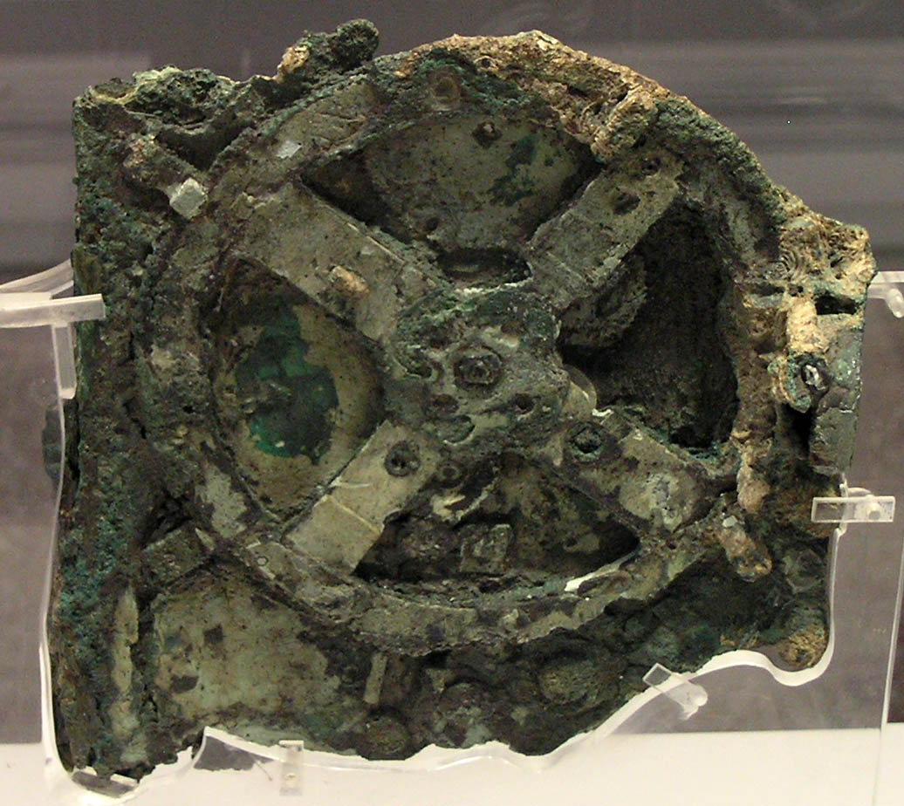

[antikythera mechanism](https://en.wikipedia.org/wiki/Antikythera_mechanism)

One topic that drags my attention is "ancient civilizations" (don't confuse with "ancient aliens" 👽). I like to think about the idea that there were multiple advanced civilizations in the past, maybe hundreds of thousands, or even million years ago; but we couldn't find any trace about them because they were wiped out for some cataclysmic event, like an asteroid, a volcanic mega-eruption. After that, because of the stupidly long amount of time and the Earth and Nature just following their course, these civilizations disappeared forever.

But, what if they weren't wiped out? what if the same society collapsed themselves, not because of war or Nuclear weapons, but their own citizens or government decided to destroy their own advances? books burned, cities consumed by fire, robots, or whatever technical advance the had destroyed. That wouldn't necessarily mean they wiped themselves, but instead, they grew up so fearful of technology that eventually they decided to destroy, a HUGE dark age, resulting in us not understanding their traces because there is no way for us to figure them out. Just imagine a person not familiar with electricity, thousands of years from now, trying to understand how to read the wikipedia from a computer: would they even know that rectangular thing works with energy? would they understand how to boot the system? what if the screen is broken? how would they connect to internet? and how would they understand they need HTTP before even trying to locate wikipedia.com 

As I read more news about the reasons people protest against technology and science, I've realized we don't need a catastrophic event to go backward on our technological advances, it's only a matter of having enough fearful people to take action against ourselves: 5G, Vaccines, planes (chemtrails), face masks, the roundness of this planet… some people will fear what they cannot understand, and yes, they're a minority now, but those numbers may grow in the future.

Maybe in the future we won't have an asteroid, or a nuclear war, or not even climate change will do it, maybe our great filter will be ourselves, fearful of technology advances and convinced to destroy it, along with any of their traces, so our future generations will need to re-discover energy, physics, computers… just doomed to start over and over again. Until we mature enough as civilization so we can actually accept it.