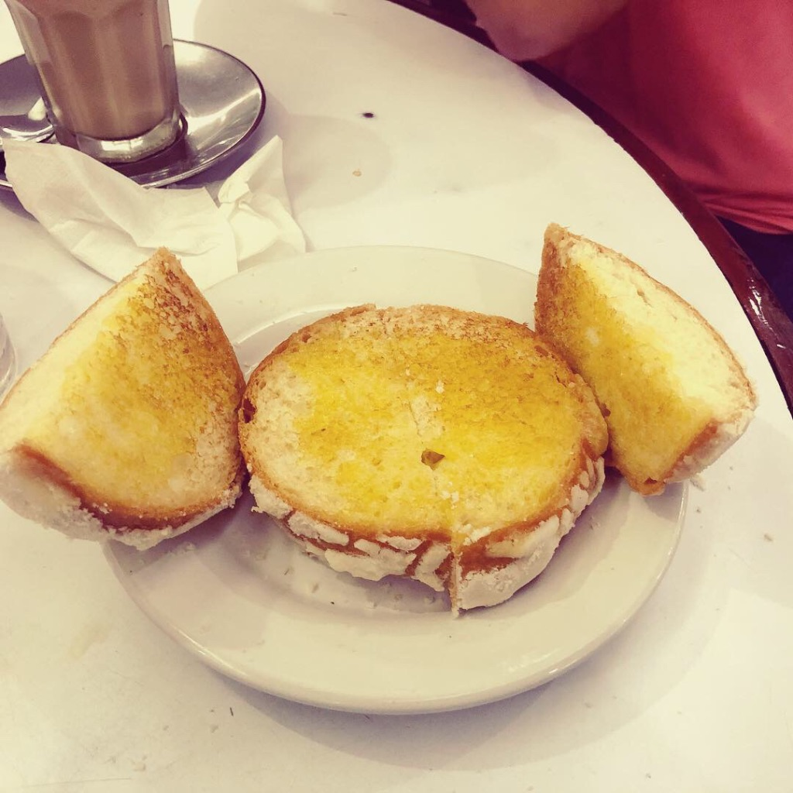

I’m starting a [Journal](https://www.huffpost.com/entry/blogging-vs-journaling_b_3693279) series to write about my personal adventures, experiences and [learnings](https://www.youtube.com/) from the week, I haven’t decided yet if I’m going to write on a specific day or it will be random (**implying** I will actually have a Journal #2 lol). This is based on a similar idea from other personal blogs I’ve been following and to expect I could come up with more ideas and, overall, I could pass through my constant fears about being judged and laughed at, Internet style (that is, maximum troll with [doxxing](https://twitter.com/) and all the whole package).
Anyway, that was quite an introduction, let me get started.

- 🏖 Last Wednesday I was at the beach with my family, it was like 6 years since the last time I was at the beach or taking a day to **actually** relax and enjoy myself; it was like 10 years since the last time I gave me time to pass with my mom; and it was like the first time me and my girlfriend got to enjoy the day without worrying about **anything** else. I would definitely do it again, it was perfect.
- 📚 On Thursday, I got a time to take some rest from the previous day lol. I started to read through the Book [Clean Architecture, by Robert C. Martin](https://www.amazon.com/Clean-Architecture-Craftsmans-Software-Structure/dp/0134494164) , which I bought like 2 months ago but I was being too lazy to start reading. It’s actually pretty god and 6 days later I’m at 60% of it (according to the Kindle App), once I started I couldn’t stop and every time I get some free time, I continue reading it.
- 🍽 On Friday, after 4 straight days doing 1 hour of jogging down the beach, we got visited by an old friend form college, there we got to take some of the best food you could get in ~[Veracruz, Mexico](<https://en.wikipedia.org/wiki/Veracruz_(city)>)~ (pic related).
- 🌮 On Saturday, I got to get more time to visit my family, given that I was on my hometown, I managed to get a chance to visit them and greet in person, it was a nice experience, different from a regular Saturday for me. On the evening we got a romantic dinner with my girlfriend ( [tacos](http://www.losgiros.com/) lol, best-dinner-ever) 😍🥰
- 🛫 On Sunday, travel day, it was a back-to-reality day: Time to say goodbye to my family and say hello to the workload and check email, Slack and any other messages for the upcoming Monday. yay! 😢
- 👨‍💻 Monday and Tuesday have been more about the same. Work, work, work. I’ve continued reading Clean Architecture and using my free time as best as I could: separating garbage in [PETE](https://en.wikipedia.org/wiki/Polyethylene_terephthalate) , cardboard and Others; taking care of my dogs; reading through my Pocket list (I only have 128 articles left, from 350 I started with 2 months ago 🎉); greeting friends and family and spending some time learning Swift 5.
- ✍️ Today I ~~remembered~~ decided it was a good time to come back to my blog, I created it to put whatever I wanted, but I have actually been almost inactive for a long period of time. So I’m starting these series now and hopefully I will catch up with some new topics in the coming weeks.
  That’s pretty much it, I have been skipping my training this week, my knees hurt (not really, but I need to blame something else bu myself).
